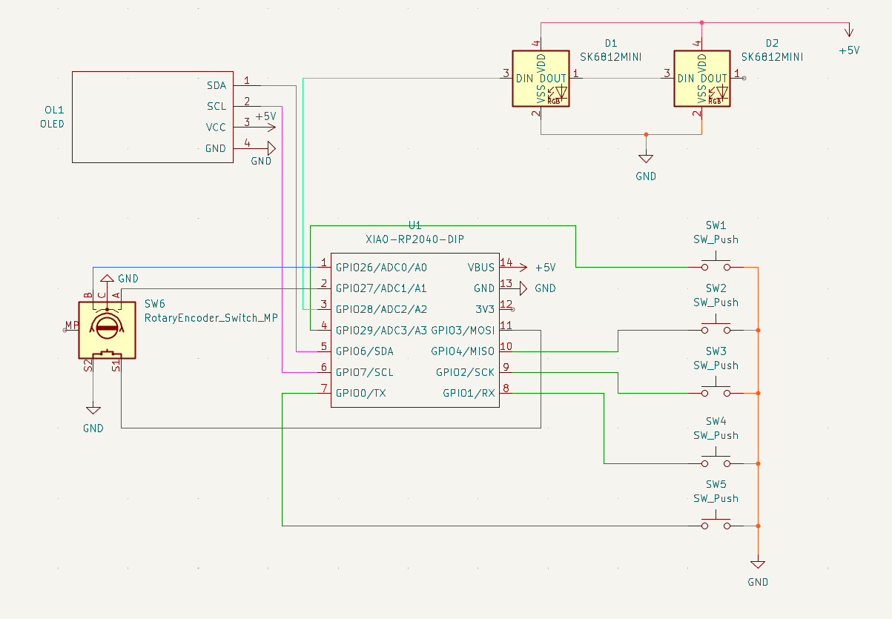
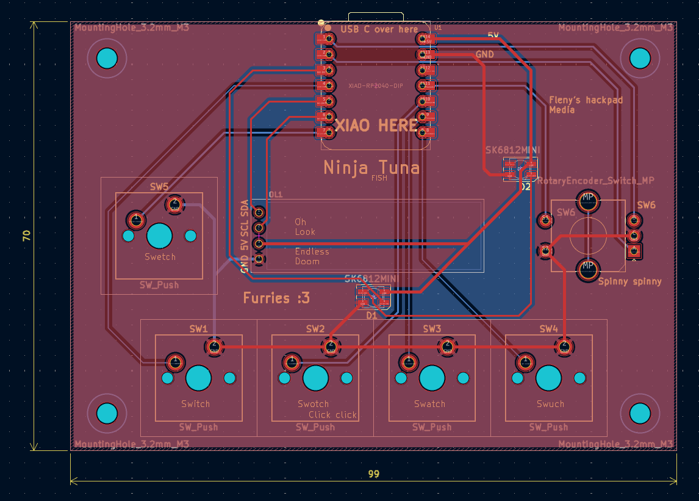
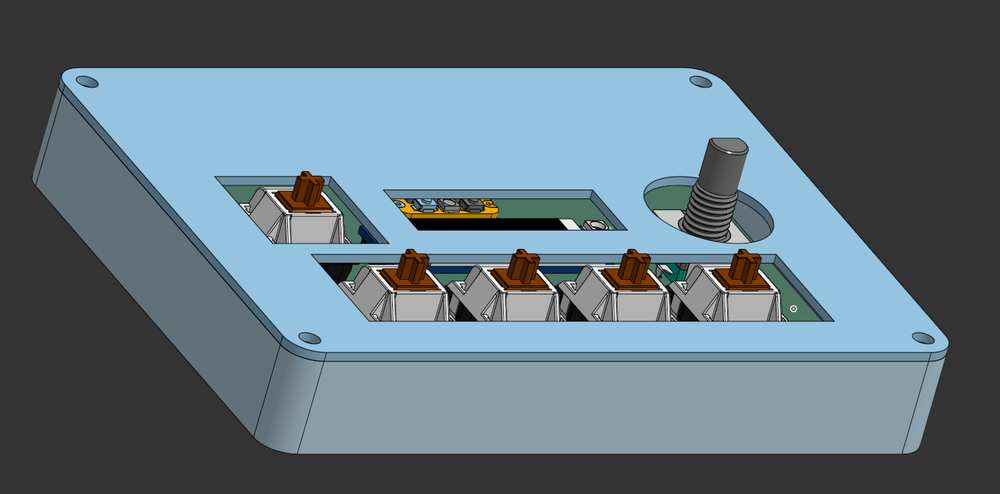
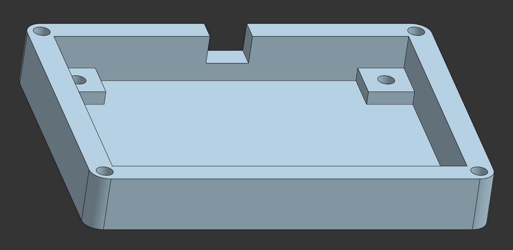
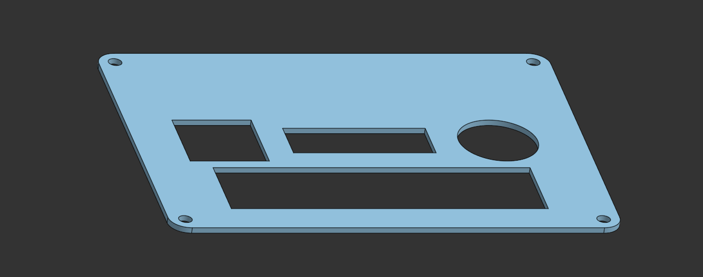

# Fleny's Hackpad

Repo containing the files for my HackPad made for Blueprint by Hack Club.

It has a rotary encoder for volume, 4 keys for media control with an extra one for anything that might be useful and a OLED to show information about the media.

This is my first time doing any PCB and CAD work, so hopefully there isn't a mess

## BOM

- 1x Seeed Studio XIAO RP2040
- 1x 0.91 inch OLED displays
- 1x EC11 Rotary encoder
- 2x SK6812 MINI-E LEDs
- 5x MX-Style switches
- 8x M3x5mx4mm heatset inserts
- 8x M3 Screws

## Images

### Schematic

The schematic for the hackpad

### PCB

The PCB of the hackpad

PCB without the zones shown

The PCB but with the zones hidden as I find them confusing when searching the traces
 

### CAD

#### Entire assembly:

 

#### Only the body:

 

#### Only the lid:

 
